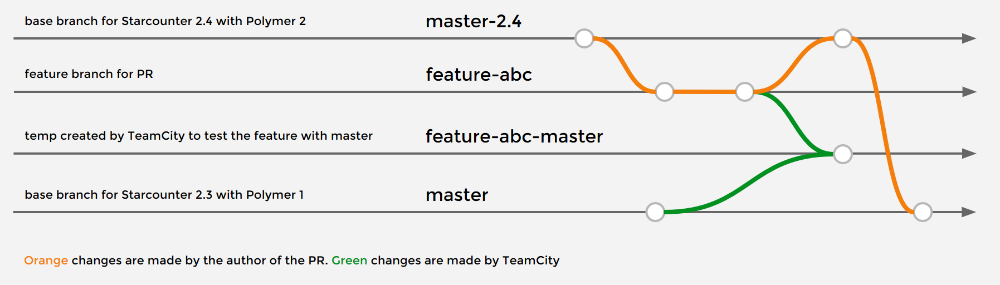

# Developer instructions

## Branches

This repo supports Starcounter 2.4.0 with Polymer 2 (`master-2.4` branch) and Starcounter 2.3.1 with Polymer 1 (`master` branch). The views in the repo are hybrid.

All changes should be hybrid, made as a PR to the `master-2.4` branch. 

The build server is configured to attempt testing the PR with Starcounter 2.3.1 and 2.4.0 automatically.

The person who merges the PR to `master-2.4`, should also do the manual merge of `master-2.4` to `master`, but only if the TeamCity build is passing with Starcounter 2.3. This does not have to be a PR.

The following diagram illustrates the typical workflow:



If it is not possible to make a fully hybrid change, please split the PR into two parts - one common part for `master-2.4` and one special part for `master`.

## How to build and run

### Build and run using CLI

1. Clone this repo to your local machine
2. Build the solution by executing `build.bat` in Windows or `./build.bat` in Git Bash
3. Run it by executing `run.bat` in Windows or `./run.bat` in Git Bash
4. Go to [http://localhost:8080/UniformDocs](http://localhost:8080/UniformDocs)

### Build and run using Visual Studio

1. Clone this repo to your local machine
2. Open the `.sln` file in Visual Studio
3. Build and run it using Debug in Visual Studio (**Debug** > **Start debugging** or <kbd>F5</kbd>)
4. Go to [http://localhost:8080/UniformDocs](http://localhost:8080/UniformDocs)

## Contributing code

To contribute code to this repository, follow the instructions in the [guidelines](https://github.com/Starcounter/CompanyTrack/blob/master/AppsTeam/Guidelines/version_control/contributing_code.md).

## How to release a package

To release the app to the warehouse, follow the instructions in the [guidelines](https://github.com/Starcounter/CompanyTrack/blob/master/AppsTeam/Guidelines/releasing-to-warehouse.md).

## How to deploy to `uniform.starcounter.io`

1. Make sure that the new version of UniformDocs is released to the App Warehouse
2. Connect via RDP to 54.194.101.35 (credentials in `N*********.kdbx`)
3. In RDP, wipe out the current data by running `staradmin delete db default` 
4. Install the current version of Starcounter 2.4 from http://downloads.starcounter.com/
5. Start Starcounter by running `staradmin start server`
6. Create a new database on port 80 by running `staradmin new db default DefaultUserHttpPort=80`
7. In Administrator, go to the database `default` and install the current version of UniformDocs from App Warehouse
8. Go to https://uniform.starcounter.io/ to verify that the new UniformDocs is correctly deployed

## Testing

### Prepare your environment

Before running the steps, you need to:

- Download and install Visual Studio 2017 to run the tests
- Download and install Java, required by Selenium Standalone Server
- Download Selenium Standalone Server and the drivers [Microsoft WebDriver (Edge), Google ChromeDriver (Chrome) and Mozilla GeckoDriver (Firefox)] using [these instructions](https://docs.starcounter.io/cookbook/acceptance-testing-with-selenium).
- Add path to the folder with drivers to system path on your computer

### Run the test (from Visual Studio)

1. Start Selenium Remote Driver: `java -jar selenium-server-standalone-3.*.jar`
2. Open `UniformDocs.sln` in Visual Studio and enable Test Explorer (Test > Window > Test Explorer)
3. You need to install NUnit 3 Test Adapter in VS (Tools > Extensions and Updates... > Online) in order to see tests in Test Explorer window
3. Start the UniformDocs app
4. Press "Run all" in Test Explorer
   - If you get an error about some packages not installed, right click on the project in Solution Explorer. Choose "Manage NuGet Packages" and click on "Restore".

### Run the test (from command line)

1. Start Selenium Remote Driver with the enablePassThrough option off: `java -jar selenium-server-standalone-3.*.jar -enablePassThrough false`
2. Build the solution (`build.bat`)
3. Start the UniformDocs.Test runner (`test.bat`)

To run a specific test, add the param `--test="<testname>"`.

To connect to a remote web driver on a different host, add the param `--params="Server=<Uri>"`

To run in a specific browser, add the param `--params="Browsers=<BrowserName>"` (case sensitive). Possible values: `Chrome`, `Firefox`, `Edge` (separated by a comma). 

```
test --params="Server=http://192.168.1.49:4444/wd/hub" --params="Browsers=Chrome" --test="UniformDocs.Tests.Test.TextareaPageTest(Chrome).TextareaPage_WriteToTextArea"
```
