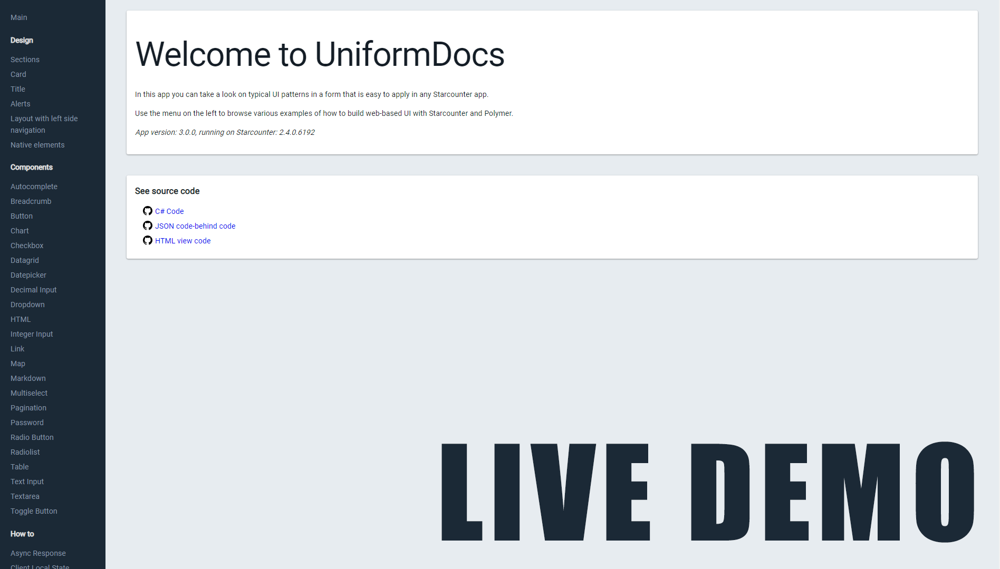

# UniformDocs

Present typical UI patterns in a form that is easy to apply in any Starcounter app.

📖 There are two GitHub repos:

- [uniform](https://github.com/Starcounter/uniform) is used to discuss the design system: guidelines, components, look and feel
- [UniformDocs](https://github.com/Starcounter/UniformDocs) is used to discuss the sample app and changes in that app

## Demo

You can find a hosted demo of the UniformDocs app on [uniform.starcounter.io](https://uniform.starcounter.io/).

## Features

- Rendering (Breadcrumb, Chart, HTML, Link, Map, Markdown, Pagination, Table)
- Server Push (Async Response, Cookies, Dialog Box, Flash Message, Lazy Loading, Nested Views, Progress Bar, Redirect, Client Local State)
- User Input (Autocomplete, Button, Checkbox, Datepicker, Dropdown, Decimal Input, File Upload, Integer Input, Multiselect, Password, Radio Button, Radiolist, Text Input, Textarea, Toggle Button)

The guidelines for this project are:

- ❌ **Do not** put styles or HTML classes in the light DOM because they pollute the global scope.
- ✔️ Put unstyled HTML and custom elements in the light DOM and style them in the Shadow DOM.
- ❌ **Do not** keep application logic in JavaScript, especially avoid JavaScript that pollutes the global scope.
- ✔️ Keep presentation logic in custom elements. Install external custom elements via Bower.
- ✔️ Use external libraries in C# when helpful. Install them via NuGet.

It is recommended to follow these guidelines for Starcounter apps in general.

## Requirements

This repository uses features from C# 7. Thus, **Visual Studio 2017** is required to build. 

If you really want to use VS 2015 and you don't care about IntelliSense warnings, you can build by installing [Microsoft.Net.Compilers](https://www.nuget.org/packages/Microsoft.Net.Compilers/) in the project using NuGet (`Install-Package Microsoft.Net.Compilers`). That will make VS use the C# compiler provided in the package instead of the default one.

## Developer instructions - Contributing

For developer instructions, go to [CONTRIBUTING](CONTRIBUTING.md).

## License

MIT
